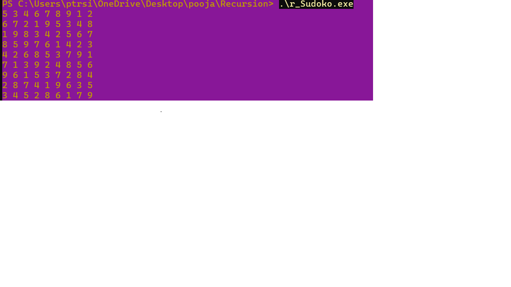

# sudoku-solver
This project is an efficient and fully functional Sudoku Solver implemented in C++, utilizing the classic Backtracking Algorithm combined with recursive depth-first search to fill the Sudoku grid while maintaining all game constraints.

FEATURES:
Accepts any valid 9x9 Sudoku grid as input.  
Automatically solves the puzzle using a backtracking algorithm.  
Displays the solved Sudoku in a clear format.  
Lightweight and easy to run using Sublime Text.  

TEXT EDITOR USED:
Sublime text
